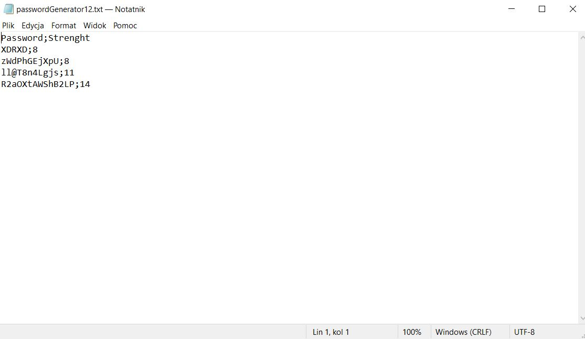

## PASSWORD GENERATOR

A project prepared in C# using WPF. It is a password generator that allows the declaration of password length and parameters (e.g., lowercase/uppercase letters). The password strength is determined based on specified characteristics. The generated string can be saved to a list and then exported to a txt file.

## How it works?

Declare the password length. The minimum number of characters is 5, and the maximum is 99. You can adjust the length using up/down arrows or enter it manually. If the manually entered value is less than 5, it will automatically change to 5 when you leave the field. It is not possible to enter three-digit numbers or higher.

Specify the parameters you want in your password. Options include LowerCase, UpperCase, Numbers, SpecialSign, and UnderCore. If nothing is selected, the script will generate a password with all parameters.

After clicking on 'Generate password', the generated password will appear in a TextBox. The strength will be indicated as weak/medium/strong, and a color will visualize the strength.

If the password suits you, click on 'Save' (the button is disabled when no password is generated). The password will be saved to the list. Records in the list can be deleted, and the entire list can be cleared. 
The created password list can be imported into a txt file. 

The txt file will be saved in the Downloads folder.

